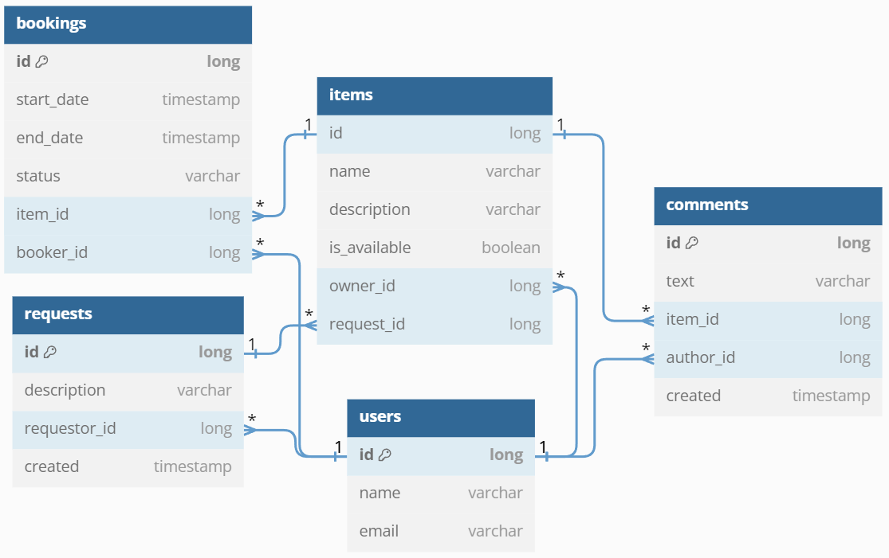

# share it - приложение шеринга вещей
[](https://www.oracle.com/java/)
[](https://spring.io/projects/spring-framework) 
[](https://www.postgresql.org/)
[](https://hibernate.org/)
[](https://maven.apache.org/)
[](https://www.docker.com/)
[](https://junit.org/junit5/docs/current/user-guide/)
[](https://site.mockito.org/)
[](https://www.postman.com/)
[](https://restfulapi.net/)

## Описание
Приложение объединяет людей. Одним из них необходима вещь (дрель, гитара, пылесос и так далее), а вторые готовы ей поделиться
## Архитектура
Приложение разделено на 2 микросервиса
- server - содержит бизнес-логику
- gateway - сервис по валидации данных перед тем, как они попадут на микросервис server

Для микросервиса server имеется своя БД Postgres. Микросервисы и БД запускаются в docker-контейнерах

## Функциональность
## Диаграмма базы данных


## Тестирование
Реализованы тесты разных слоёв приложения:
- сервис-слой. 4 сервиса - 67 юнит-тестов с использованием Mockito и Junit, для инициализации моков использовалась аннотация @ExtendWith; 24 интеграционных теста, автоматическая настройка контекста Spring Boot - аннотация @SpringBootTest
- web-слой. 4 контроллера - 46 тестов с применением фреймворка MockMvc и аннотаций @WebMvcTest и @MockBean
- слой JPA-репозиториев. 2 репозитория - 4 теста, применяя аннотацию @DataJpaTest
- слой работы с Json. Для 9 классов DTO проверялась сериализация и десериализация Json, применяя аннотацию @JsonTest
## Как запустить и использовать
Для запуска необходимо, чтобы на ПК была установлена и открыта программа [Docker Desktop](https://www.docker.com/products/docker-desktop/). После установки откройте командную строку cmd и выполните следующие команды

   ```
git clone https://github.com/OsipovKonstantin/java-shareit.git
   ```
В командной строке перейдите в корень проекта. Затем:
   ```
mvn clean package
   ```
   ```
docker-compose up
   ```
Приложение готово к использованию! Сервис доступен по андресу [http://localhost:8080](http://localhost:8080)

Со сценариями работы приложения можно ознакомиться, посмотрев и запустив [коллекцию Postman-тестов](postman/sprint.json)
